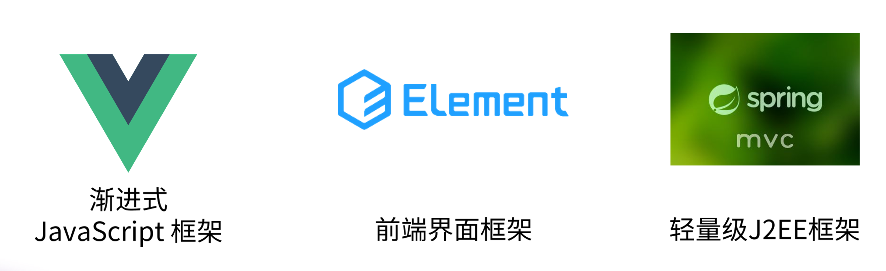
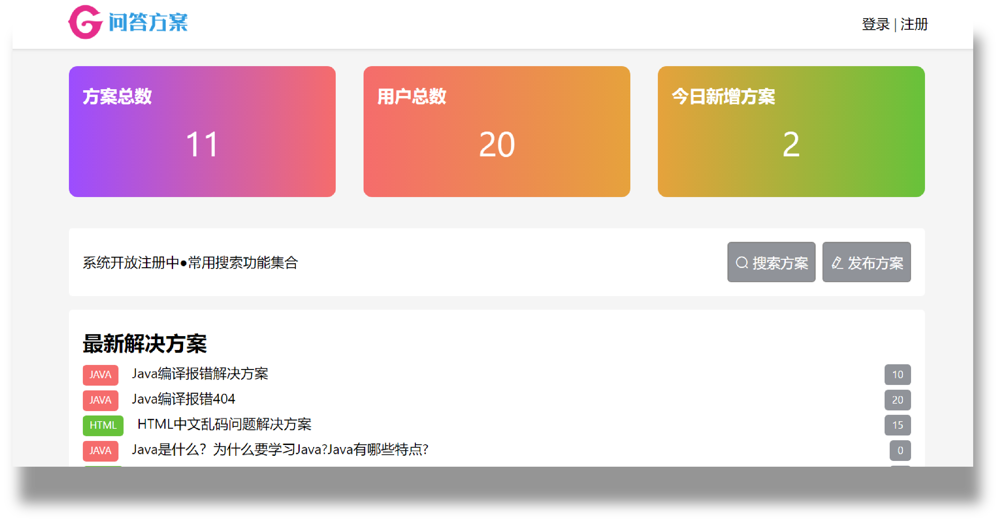
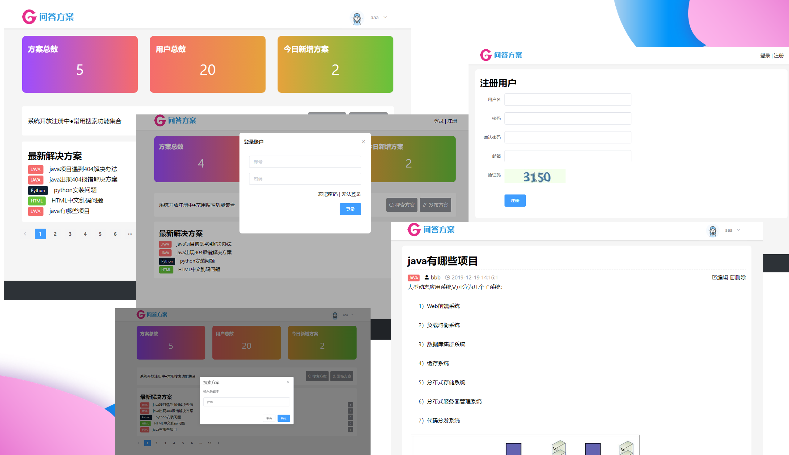

## 问题方案解决系统

使用VUE+element+SpringMVC实现
数据库使用mybatis实现。  
项目管理使用maven仓库。  

前后端分离，纯前端，ajax请求数据。  

已经实现功能：  
1.登录  
2.添加数据  
3.方案显示  

预留接口  
注册  
删除文章  
编辑方案  

模块化结构，很方便后期拓展。
改个名字就能二次开发了。

适合期末答辩使用

